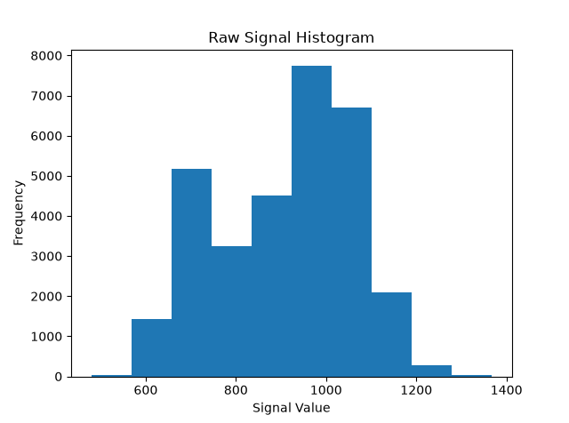
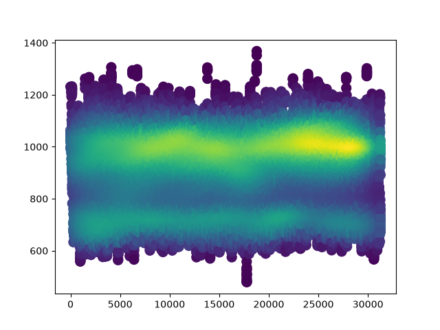
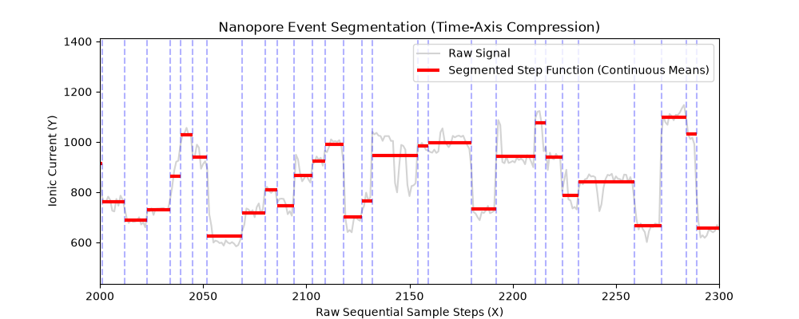

# NanoCore Basecaller

A from-scratch nanopore signal basecaller implementing the classical pre-2019 pipeline: raw ionic current segmentation via rolling t-test change-point detection, followed by Viterbi decoding over a 5-mer hidden Markov model.

Built to understand the signal-level mechanics of nanopore sequencing at the algorithm level — no black-box basecallers, no abstraction layers.

---

## Pipeline Architecture

```
Raw ADC Signal (int16)
        ↓
Physical Calibration          offset + range / digitisation → picoamperes
        ↓
Change-Point Segmentation     rolling t-test, window-based variance comparison
        ↓
Event Sequence                collapsed mean current per stable segment
        ↓
Viterbi Decoder               log-space HMM over 1,024 5-mer states
        ↓
Base Harvest                  kmer overlap collapse → DNA sequence string
```

This mirrors the architecture used by ONT's Metrichor (2014–2016) and described in [Loman et al. 2015](https://www.nature.com/articles/nmeth.3444) — the landmark nanopolish paper that first demonstrated full bacterial chromosome assembly from nanopore reads alone.

---

## Components

### `segment.py` — Change-Point Detection
Segments a continuous ionic current signal into discrete events using a rolling two-sample t-test. At each position, the signal is split into a leading and trailing window; a large t-statistic indicates a sudden shift in current level corresponding to a new k-mer entering the pore.

- Window size and threshold are tunable
- Outputs event list with mean current, duration, start, and end indices
- Visualizes raw signal overlaid with segmented step function

### `viterbi.py` — HMM Decoder
Decodes the event sequence into a DNA string using Viterbi over a 1,024-state HMM where each state corresponds to one 5-mer (AAAAA through TTTT).

- Transition matrix encodes motor protein physics: 75% stay probability, 25% distributed across 4 forward shifts
- Emission model: Gaussian per state with empirically motivated means derived from base composition
- Log-space computation throughout for numerical stability
- Kmer overlap harvesting: first event emits full 5-mer, each subsequent transition appends one base

---

## Results

### Raw Signal Distribution
Histogram of raw ADC signal values across a single read (~31,000 measurements). The multimodal structure — distinct peaks around 650, 750, 950, and 1050 ADC units — reflects the quantized nature of ionic current levels as different k-mers occupy the pore. This is real biological signal, not noise.



### Signal Density Over Time
Kernel density heatmap of signal value vs. sample index. The yellow region (~1000 pA, samples 15000–25000) shows where the read spends the most time — a stable, high-occupancy current level indicating a dominant k-mer population in that region of the molecule.



### Event Segmentation (zoomed)
Raw ionic current (gray) overlaid with detected event boundaries (blue dashed) and segment mean levels (red). Zoomed to samples 2000–2300 to show individual events clearly — each red horizontal segment represents one collapsed event passed to the Viterbi decoder.



### Decoded Output
Sample basecalled sequence from read `read_000d8902-c0b1-44e1-93b3-a8792b7edd22`:

```
ATATAAATTTTAAATATAAAAACAAAAATTTTAAAAATATTTCTAAAAGTTTTCTATTTTAAAGATATCTATGAAAAAGAAATATATATAAAGAAAAATAAAAACAAAAATATTTCTAGAAAATTTTTGAATTTTTATCTAGATTTTTACAGAAATATAAAAATATATATATTTTAAAAATTTTTATATAAAAATTTTAA
```

---

## Setup

### Requirements
```bash
pip install h5py hdf5plugin vbz_h5py_plugin numpy matplotlib
```

> **Note:** VBZ codec registration must happen before h5py opens the file.
> `vbz_h5py_plugin` handles this — import order matters.

### Data
Tested on Oxford Nanopore MinION FAST5 multi-read files (R9/R10 chemistry).
Public FAST5 datasets are available from [NCBI SRA](https://www.ncbi.nlm.nih.gov/sra).

### Run
```bash
# Segmentation + visualization
python segment.py

# Full basecalling pipeline
python viterbi.py
```

---

## Limitations

This is a research reimplementation, not a production basecaller. Known limitations:

- **Synthetic pore model** — emission means are derived from base composition heuristics, not empirically measured R10.4.1 parameters. Real ONT pore models are available as published CSVs.
- **Viterbi only** — no forward-backward algorithm, so per-base confidence scores are not available.
- **No beam search** — full Viterbi over 1,024 states is exact but slow at scale. Production basecallers use CTC decoding with beam search over a neural network.
- **Accuracy** — expect significantly lower accuracy than Guppy or Dorado. This is intentional: the goal is architectural transparency, not competitive performance.

---

## Background

Modern basecallers (Guppy 2019+, Dorado 2023) use end-to-end neural networks (BiLSTM or Transformer + CTC loss) that implicitly learn segmentation from raw signal. This project implements the prior generation of explicit segmentation + HMM decoding that dominated from ONT's commercial launch (~2014) through ~2018.

Reading this codebase alongside [Chiron (Teng et al. 2018)](https://academic.oup.com/gigascience/article/7/5/giy037/4966989) — the paper that demonstrated neural approaches outperforming event-based HMMs — gives a clear picture of why the field moved on and what was gained and lost in that transition.

---

## References

- Loman et al. (2015) — *A complete bacterial genome assembled de novo using only nanopore sequencing data* — Nature Methods
- Teng et al. (2018) — *Chiron: Translating nanopore raw signal directly into nucleotide sequence using deep learning* — GigaScience
- Oxford Nanopore Technologies — R10.4.1 pore model specifications
